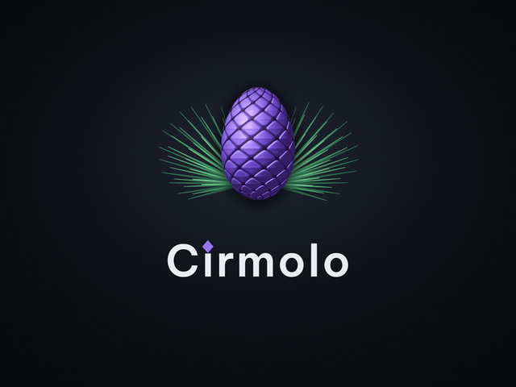
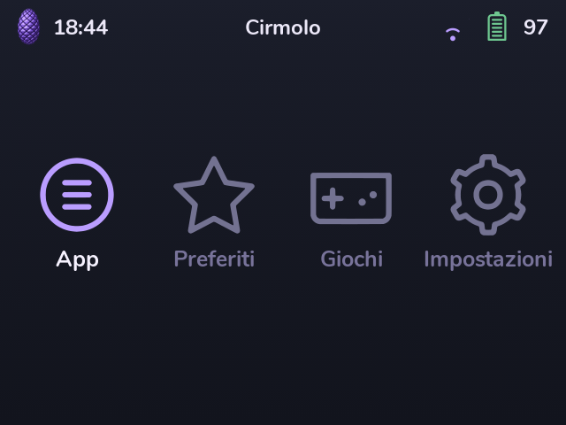
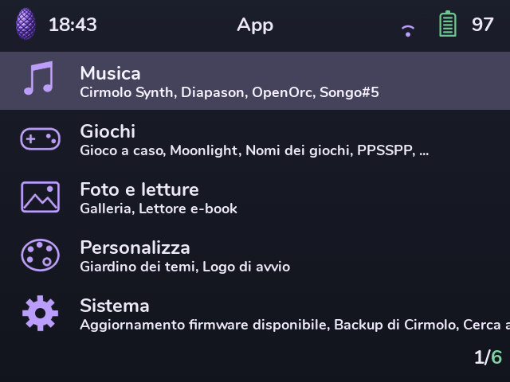
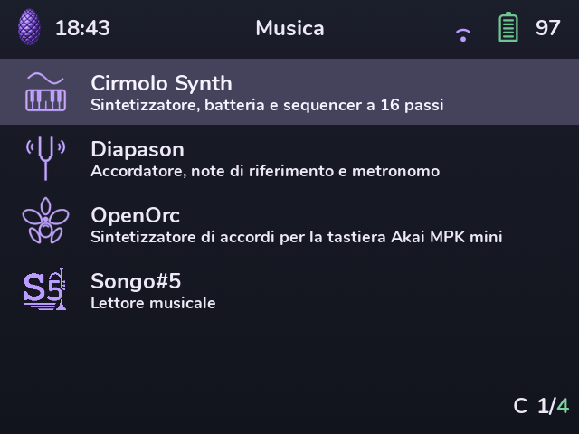
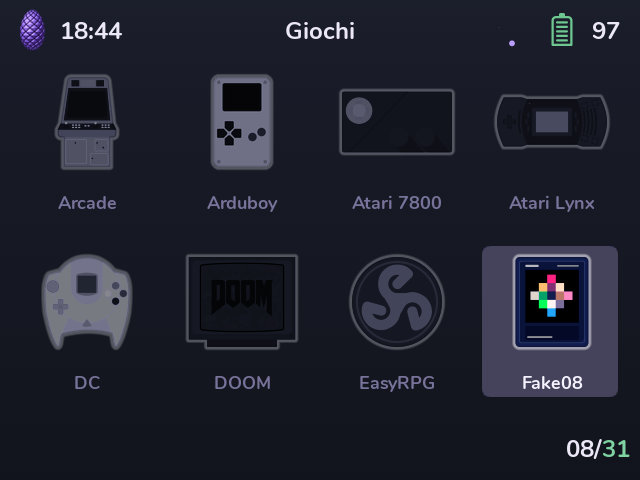
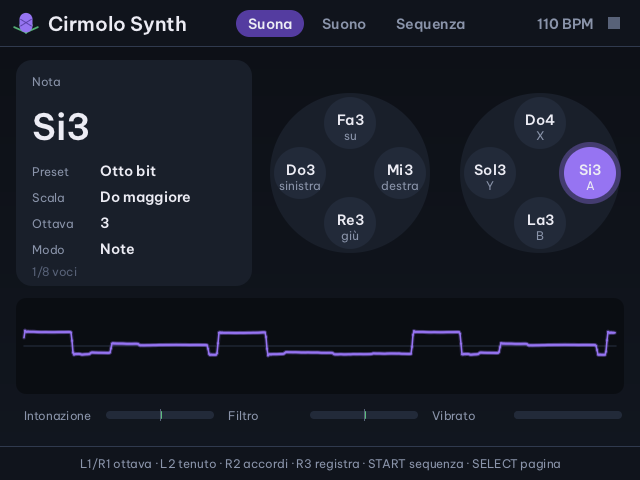
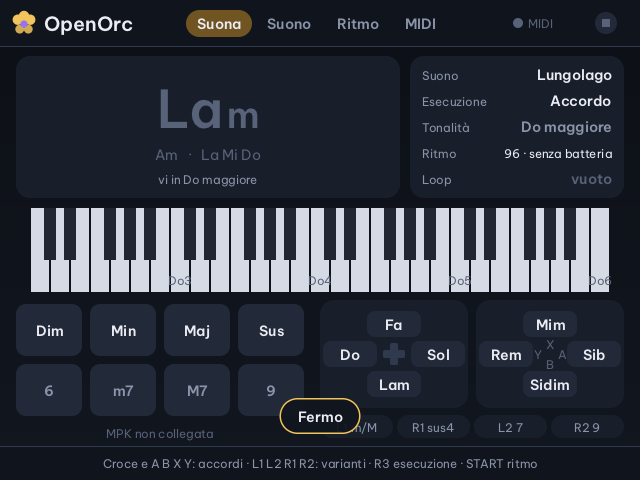

  

# Cirmolo

**AI & Music OS for handhelds**

*English · [Italiano](README.it.md)*

**Cirmolo** is a fork of [spruceOS](https://github.com/spruceUI/spruceOS) built for the **Miyoo Flip**.
The interface is **Italian by default**, in honour of the fork's origins; English and the other spruceOS languages stay one setting away (Language Settings).
The name comes from *cirmolo*, the Swiss stone pine of the Dolomites: a fragrant, tough wood and a cousin of the spruce.

> **Status:** in development, tested on the Miyoo Flip only. Use it at your own risk, like spruceOS.

  
  
  
  
  
  

## What changes compared to spruceOS
- **Complete Italian localization:** the interface (PyUI), the settings menus, descriptions and values. The style guide is in [`.github/i18n/it/GLOSSARIO.md`](.github/i18n/it/GLOSSARIO.md).
- **Translation tooling** in [`.github/i18n/`](.github/i18n/), useful for every language: it extracts the keys the code actually uses, aligns `English.json` and validates the files.
- **OTA updates from the Cirmolo feed:** an update never brings back plain spruceOS.
- **Bug reports:** the report stays on the SD card and goes into a [Cirmolo issue](https://github.com/luigismith/cirmolo/issues) instead of the spruce team's server.
- **Cirmolo version** in About this Device.
- **Cirmolo boot logo** (the violet pine cone) and a **safer logo change on the Flip:** before rewriting the internal flash, the Boot Logo app checks the battery, copies the whole internal flash to the SD card with checksums, verifies the boot partition and restores the copy by itself if the write fails.
- **Cirmolo theme**, the default: the logo's colours (night, violet cone, green needles) across menus, app and area icons, loading and charging animations and system screens, with the pine cone in place of the spruce tree. It is derived from tenlevels' Spruce theme ([`.github/branding/tema_cirmolo.py`](.github/branding/tema_cirmolo.py)), which is still available.
- **Apps grouped into folders** (Music, Games, System, Other...).

### New native apps
Written in C for the Flip on a shared kit ([`spruce/cirmolo-kit`](spruce/cirmolo-kit)): graphics, buttons, audio and USB MIDI keyboards. Cirmolo Synth, Diapason and OpenOrc are in Italian only for now.
- **Cirmolo Synth** ([`App/CirmoloSynth`](App/CirmoloSynth)): 8-voice synthesizer with a resonant filter, drums and a 16-step sequencer, patterns A-D, arpeggiator, presets and WAV recording. Play it with the buttons or a USB MIDI keyboard.
- **Diapason** ([`App/Diapason`](App/Diapason)): tuner, reference notes and metronome.
- **OpenOrc** ([`App/OpenOrc`](App/OpenOrc)): a chord synthesizer for the Akai MPK mini IV keyboard, inspired by the Orchid. Four sound engines, six ways to play a chord (strum, arpeggio, harp...), drums, a looper, an oscilloscope and a MIDI page that learns controls. The keyboard preset and a setup sheet for the MPK are in [`App/OpenOrc/tastiere`](App/OpenOrc/tastiere/akai-mpk-mini-iv.md). Without a keyboard you play it with the Flip's buttons.
- **Cirmolo Piano** ([`App/CirmoloPiano`](App/CirmoloPiano)): a General MIDI instrument for a USB MIDI keyboard, built on TinySoundFont with the GeneralUser GS SoundFont (287 presets, drum kits on channel 10). Instruments by GM family, a keyboard view with the notes lit, an oscilloscope; without a keyboard the Flip's buttons play eight degrees of a chosen scale.
- **LittleGPTracker** ([`App/LittleGPTracker`](App/LittleGPTracker)): the "piggy" sample tracker, LSDj-style and made for gamepads, as the official aarch64 build (GPLv3) with its sample library and the Flip's pad mapping. Hold MENU to quit.
- **Picoloop** ([`App/Picoloop`](App/Picoloop)): synth and step sequencer in the nanoloop spirit with ten engines (virtual analogue, OPL2, SID, 303, drum machines...), built for the Flip from the upstream sources (GPL; patch and build script in `src/`). Hold MENU to quit.
- **Ask AI** ([`App/ClaudeChat`](App/ClaudeChat), *Chiedi all'IA* in Italian): chat with AI models, by voice too. Claude comes first and is the default; there are also OpenAI, Gemini, DeepSeek, Qwen, GLM, Kimi, MiniMax, Groq, OpenRouter, Mistral, Cerebras and any OpenAI-compatible server (for example Ollama on your home PC, through `fornitori.json`). Some have free models (GLM Flash, Groq, OpenRouter `:free`, Mistral). Hold R2 to talk (USB microphone or headset; Bluetooth headsets are experimental), and answers can be read aloud (transcription with Groq, OpenAI or Gemini; speech with OpenAI or Gemini). The interface is available in ten languages. It needs Wi-Fi and your own API keys, which are stored on the SD card only.
- **Console-wide AI features** (Console tab of Ask AI, with a model that reads images; GLM-4.6V-Flash is free):
  - **Game translator**: in RetroArch games, SELECT + Down pauses and shows a translation of the on-screen text (for example from Japanese), and can read it aloud. A small server for RetroArch's AI service starts and stops with the game; translations are kept in `Saves/claude/traduzioni`.
  - **Game card**: from a game's menu in PyUI (MENU, "Game card (AI)"), a card with box art: summary, story, how to play, tips and trivia, to read or listen to. It is saved, so the next time it opens instantly.
  - **Play diary**: at the end of every session it records the game, the playing time and the last screen; with AI also where you left off, shown as a reminder when you reopen the game and in the game card.
- **What should I play?** ([`App/CosaGioco`](App/CosaGioco)): three questions (time, mood, new or unfinished) and the model picks four games from your SD card, taking the diary into account; A starts the game.

**Coming next:** more apps and improvements to the interface and performance on the Flip.

## Branches and versions
- **`cirmolo`** (default): Cirmolo development.
- **`release/0.2`**: the published version, see the [releases](https://github.com/luigismith/cirmolo/releases); `release/0.1` stays as it was for 0.1.0.
- **`Development`**: an exact mirror of spruceOS, used to pull in upstream updates. The other branches come from spruceOS.

## Credits and license
- Cirmolo exists thanks to the work of the **spruceUI** team and the spruceOS contributors: all credit for the base goes to them.
- Like spruceOS, it is licensed **CC BY-NC 4.0** (non-commercial use, with attribution): see [LICENSE](LICENSE). Third-party components keep their own licenses.
- It does not and never will contain games or BIOS files.
- Please report problems and ideas in the [Cirmolo issues](https://github.com/luigismith/cirmolo/issues), not to the spruce team.

---

<b>Original spruceOS README</b>: features, devices, spruceUI team credits

# spruceOS 

  - SpruceOS is a community software package intended to help you get the most out of your Miyoo, TrimUI and Anbernic RG XX devices.
  - Our mission is to provide a balanced user experience for both brand new and well-seasoned emulation enthusiasts alike: sane and well-optimized defaults for those who don't want to tweak settings, but immensely deep customization options for those that do.
  - Spruce is intended to be sleek, intuitive, efficient, and user friendly. We hope that you enjoy it.

    _We are not responsible for damage to your device. You must use spruce and its features at your own risk._

## Features

* Snappy and incredibly themeable custom Python-based UI.
* Game Switcher: seamlessly switch between save states during gameplay.
* Autosave on shutdown/autoresume on boot: automatic save state when powering off in-game; powering on will resume play from where you left off.
* Network services: Retroachievments, RTC sync via WiFi, SSH/SFTP, Syncthing, Samba and HTTP file transfer.
* CPU performance profiles pre-configured for optimized battery life and performance.
* Native Pico-8 support with Splore.
* Built-in boxart scraper app using libretro API.
* OTA updates over Wi-Fi on device.
* Game Nursery for downloading free ports, demakes, and homebrew for a variety of systems, directly to your device.
* Theme Garden for browsing and downloading an ever-growing (currently over 80!) selection of community-made themes

## Download the latest version

  - [CLICK HERE FOR THE LATEST RELEASE](https://github.com/spruceUI/spruceOS/releases)

## Need help?
  
  - [CLICK HERE TO SEE THE WIKI](https://github.com/spruceUI/spruceOS/wiki)

## Installation
  - The short version is: format your SD card to FAT32 and extract the 7z (using the 7zip app) file to your PC, then copy the files onto your SD card.
  - For more information, see the new [Wiki installation page](https://github.com/spruceUI/spruceOS/wiki/Installation-Instructions)
  - Place your BIOS files in the `BIOS` folder on the root of SD card.

## All In One Installer
  - Download [The spruceOS Installer program](https://github.com/spruceUI/spruceOS-Installer/releases/latest)
  - Simply insert your SD card into your computer and run the program, be sure to select the correct drive!
  - It formats your card, downloads the latest official spruce release, and installs it in one click!
  - Now V1.1 has a boxart scraper!

## UPDATING TO THE LATEST RELEASE
To update:

See our updating spruce [Wiki page for more info](https://github.com/spruceUI/spruceOS/wiki/01.-Installation-Instructions)

## Controls and Hotkeys

### Global

* Quicksave + Shutdown: Hold POWER for 3 seconds*
* Game Switcher: Hold MENU for 3 seconds
* Brightness down: START + L1 or MENU + VOLDOWN
* Brightness up: START + R1 or MENU + VOLUP

\*Holding POWER after the vibration occurs will cause your device to force shutdown (in case of freezes etc.)

### RetroArch (and PPSSPP)

* MOD: SELECT or MENU, depending on the device (can be changed either in RA or in spruce settings)
* Screenshot: MOD + A
* Exit to spruceUI: MOD + B
* Open menu: HOME/MENU (label differs by device)
* Open menu: MOD + X
* Toggle FPS display: MOD + Y
* Load state: MOD + L1
* Save state: MOD + R1
* Toggle slow-motion: MOD + L2
* Toggle fast-forward: MOD + R2
* Toggle current shader: MOD + D-Pad UP
* Cycle state slots: MOD + D-Pad LEFT/D-Pad RIGHT

### DSperate

* MOD = MENU (SELECT on devices with no MENU key)
* screenshot = MOD + A
* Quit = MOD + B
* Open menu = MOD + X
* Toggle FPS = MOD + Y
* Cycle state slots = MOD + left/right
* Save state = MOD + R1
* Load state = MOD + L1
* Cycle screen layouts = MOD + up/down
* change primary screen = MOD + L2
* FF hold = R2
* FF toggle = MOD + R2
* Tap stylus = L2 or L3

Zero-stick devices:
* Use D-pad as stylus = hold R2
* no FF hold button

One-stick devices:
* stylus control is on left stick

Two-stick devices:
* stylus control is on right stick
* left stick mirrors d-pad

## Themes

  - The classic spruce theme is minimalistic, but we include around a dozen default themes for you to try.
  - For additional themes, you can either download additional themes from [here](https://github.com/spruceUI/PyUI-Themes) and place the unextracted .7z archives into the Themes folder on your SD card, or you can use our Theme Garden app to browse the repository and install them over the air, directly onto your spruce device!
  - We are always seeking new themes, and would love to feature your artwork! If you are interested in contributing a theme, please reach out! There has also been some preliminary work on a [Theme Guide](https://github.com/spruceUI/spruceOS/wiki/Theme-design-guide) to help get you started.

## Active team members:

spruceOS is a volunteer community effort, with a very fluid team structure. It would be impossible to list everyone who has contributed to the project, code or otherwise. Here are some contributors from recent development cycles, in alphabetical order:

   - [Arkun](https://github.com/CatalyticArkun)
   - [Chrisj951](https://github.com/chrisj951) - Discord @chrisbastion
   - [Hario](https://github.com/Hairo)
   - [KitFox](https://github.com/orgs/spruceUI/people/KitFox0618)
   - [KMFDManic](https://github.com/KMFDManic)
   - [Lonko](https://github.com/orgs/spruceUI/people/LonkoDeLonk)
   - [Mike Kendall](https://github.com/zenkalia)
   - [Noxwell](https://github.com/beebono)
   - [RDWilliamson](https://github.com/orgs/spruceUI/people/robertdw1974-byte)
   - [Ryan "Ry" Sartor](https://github.com/ryanmsartor)
   - [SundownerSport](https://github.com/Sundownersport)
   

## Special Thanks
  - Tenlevels: Starting spruce, making kickass themes and getting the A30 where it deserves to be! Spruce would never have existed without him, we are eternally grateful to the long hours and dedication he put in. Thanks buddy!
  - Shauninman: Constant help, tech support, and inspiration (plus all the code we stole from him :D).
  - MustardOS Team: we borrowed kind of a lot from you guys... thank you!
  - Christian Haitian: updated graphics driver for Miyoo Flip; some libretro cores.
  - Knulli and the rest of the Open Handheld Collective for amazing collaboration and sharing. It takes a village! 
  - XanXic: lots of organizational improvements; designing the OTA and EZ Updaters; and so much more!
  - Onion Team: guidance and inspiration.
  - Steward, trngaje: Custom DraStic versions.
  - XK: Custom SDL2 versions for the Miyoo Mini family of devices
  - KMFDManic: Building and testing new cores (N64 F^%$ Yeah!).
  - Hoo: Testing and encouragement.
  - Metallic77: Custom lightweight shaders for the A30, and Flycast tweaks.
  - Russ from RGC: His YouTube channel is an inspiration.
  - [Icons8.com](icons8.com) for the logo, icons and their genrosity in giving us expanded access to icons for this project.
  - [Miyoo](https://lomiyoo.com/), [TrimUI](https://trimui.net/), and [Anbernic](https://anbernic.com/) for sending us development units.
  - All past and present Team Members!
  - Our wonderful nightly testers, who have provided tons of helpful feedback, bug reports, and comeradery!

THANK YOU TO THE AMAZING RETRO HANDHELD COMMUNITY!!

## AI Disclosure

Some of our contributors use AI to help code, as is the industry standard. The spruceUI organizations’s policy on AI use is that we will always judge potential contributions based on the code’s quality rather than who wrote it, or how.

## SUPPORTED GAME SYSTEMS

[Click here for a table of supported systems and file extensions.](https://github.com/spruceUI/spruceOS/wiki/11.-Adding-Games#rom-folder-chart)

## Interested in being a tester, or just hanging out? To provide feedback and speak with the development team please join our Discord server by clicking on the image below or using [this link](https://discord.gg/KjR5uMQQt9)

[Discord di spruce](https://discord.gg/KjR5uMQQt9)

